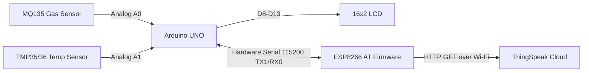
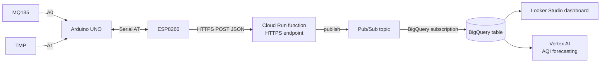

# Sensor Technical Reference — Clean Air Monitor
**Sensors: MQ135 (Air Quality) · TMP35/TMP36 (Temperature)**

| | |
|---|---|
| **Project** | Clean Air Monitor (`clean_air1.ino`) |
| **Prepared for** | Google Cloud Hackathon — Hardware/Firmware Track |
| **Document type** | Sensor datasheet digest, calibration spec & integration guide |
| **MCU** | Arduino UNO (ATmega328P) |
| **Connectivity** | ESP8266 (AT-command, Wi-Fi) |
| **Status** | v1.0 — reverse-engineered from schematic + `clean_air1.ino` |

---

## 1. Scope

This document is the authoritative hardware reference for the two analog sensors in the Clean Air Monitor: the **MQ135** gas sensor and the **TMP35/TMP36** analog temperature IC. It covers electrical characteristics, wiring, the math the firmware must implement, calibration procedure, current firmware behavior (audited against the uploaded sketch), known defects, and a production-grade cloud ingestion path on Google Cloud. It is written so a judge, teammate, or future maintainer can pick up the board with zero tribal knowledge.

---

## 2. System Architecture

### 2.1 As-built (current sketch)



### 2.2 Recommended — Google Cloud native ingestion

Cloud IoT Core (Google's former MQTT/device-bridge product) was **retired in August 2023** and is not available for new builds, so the correct 2026 pattern for a small board like this is: device → HTTPS → serverless function → Pub/Sub → BigQuery, with no third-party broker required for this data rate.



Why this shape for a hackathon:
- **No IoT Core dependency** — it's deprecated; don't design around it.
- A **Pub/Sub → BigQuery subscription** writes rows directly with zero glue code (no Dataflow needed at this data volume — one reading every ~20 s).
- **Cloud Run function** gives you a single HTTPS URL the ESP8266's `AT+CIPSTART`/`AT+CIPSEND` flow (or better, `HTTPClient` if you upgrade to ESP8266 native SDK instead of raw AT commands) can hit directly — no MQTT broker to stand up under hackathon time pressure.
- **BigQuery + Looker Studio** gets you a live dashboard for demo day with almost no code.
- **Vertex AI** is the stretch goal: train a simple forecasting/anomaly model on the BigQuery table to predict AQI trend — a strong differentiator in judging.

---

## 3. Bill of Materials & Pin Map

| Signal | Arduino Pin | Destination | Notes |
|---|---|---|---|
| MQ135 analog out (AOUT) | **A0** | MQ135 module | `pinMode(A0, INPUT)` |
| TMP35/36 Vout | **A1** | Temp sensor middle pin | `pinMode(A1, INPUT)` |
| LCD RS | D13 | 16×2 LCD | |
| LCD EN | D12 | 16×2 LCD | |
| LCD D4–D7 | D11, D10, D9, D8 | 16×2 LCD | 4-bit mode |
| ESP8266 TX/RX | TX1 (D1) / RX0 (D0) | ESP8266 module | **Hardware Serial — shared with USB debug port, see §6.3** |
| 5V / GND rails | Power header | MQ135, TMP, ESP8266, LCD | |

Confirmed directly from `clean_air1.ino`:

```cpp
const int MQ135_Pin = A0;
const int TMP36_Pin = A1;
const int rs = 13, en = 12, d4 = 11, d5 = 10, d6 = 9, d7 = 8;
```

---

## 4. MQ135 — Air Quality Gas Sensor

### 4.1 What it actually measures

The MQ135 is **not** a calibrated CO₂ or PM2.5 sensor. It's a SnO₂ (tin dioxide) metal-oxide semiconductor whose surface resistance drops in the presence of reducing/oxidizing gases. It responds broadly to **NH₃, NOx, CO₂, alcohol, benzene, and smoke** simultaneously and cannot distinguish which one it's smelling — it produces one composite "air quality" resistance reading, not a per-gas concentration, unless you calibrate a curve for one target gas (commonly CO₂, since it's the dominant background gas indoors).

### 4.2 Electrical characteristics

| Parameter | Value |
|---|---|
| Heater voltage | 5.0 V ±0.1 V |
| Heater power consumption | ≤ 800 mW |
| Load resistance (RL) | Adjustable — most breakout modules ship with a 1 kΩ or 20 kΩ RL trimmer/resistor; **10–22 kΩ is recommended for CO₂/indoor-air work** |
| Sensing resistance (Rs) in clean air | 30 kΩ–200 kΩ (10 kΩ CO₂ reference conditions) |
| Reference conditions for datasheet curve | 20 °C, 65 % RH, 21 % O₂, RL = 20 kΩ |
| Detection range | 10–300 ppm NH₃; 10–1000 ppm CO₂ (practical); also alcohol, benzene, smoke |
| Preheat / burn-in | **24–48 hours** continuous power before first calibration; ≥ 20 s warm-up on every cold power-up before trusting a reading |

### 4.3 Module pinout (4-pin breakout)

| Pin | Function |
|---|---|
| VCC | 5 V |
| GND | Ground |
| DO | Digital threshold output (comparator, adjustable via onboard potentiometer) — **not used in this design** |
| AO | Analog output → Arduino A0 |

### 4.4 Signal chain math

The sensor is a variable resistor in series with a fixed load resistor forming a voltage divider (VCC → Rs → node(AOUT) → RL → GND). From the ADC voltage you recover the sensor resistance, then convert to a gas ratio, then to ppm using the manufacturer's log-log sensitivity curve.

**Step 1 — ADC to voltage:**
```
voltage = analogRead(A0) * (5.0 / 1023.0)
```

**Step 2 — Voltage to sensor resistance (Rs):**
```
Rs = ((5.0 - voltage) / voltage) * RL
```

**Step 3 — Calibrate Ro (baseline resistance in known-clean air).** Take this reading during the 24–48 h burn-in, outdoors or in a well-ventilated room, and average many samples:
```
Ro = Rs / (ATMOCO2 / PARA) ^ (1 / -PARB)
```
where `ATMOCO2` is the assumed ambient CO₂ concentration to calibrate against (≈ 397–420 ppm is the current global outdoor baseline — update this constant periodically; outdoor CO₂ has been rising ~2 ppm/year).

**Step 4 — Rs/Ro ratio to ppm** (power-law fit to the datasheet's log-log sensitivity graph — these constants are the widely validated community-derived values, since Winsen's datasheet gives only the graph, not the fitted equation):
```
ppm = PARA * pow(Rs / Ro, -PARB)

// Empirically-fitted constants (community-standard, CO2 curve):
#define PARA 116.6020682
#define PARB 2.769034857
```

**Step 5 (production-grade, optional) — temperature/humidity compensation.** Rs drifts with ambient temperature and humidity independent of gas concentration. If you add a DHT11/DHT22, correct Rs before computing ppm:
```
correctionFactor = CORA*t*t - CORB*t + CORC - (h - 33.0)*CORD   // for t < 20°C, use the alternate branch for t ≥ 20°C
correctedRs = Rs / correctionFactor
```

> These constants are empirical fits published and cross-validated across multiple open-source MQ135 libraries (not a single-vendor number), and every physical unit needs its **own Ro** — don't hardcode someone else's Ro and expect accurate ppm.

### 4.5 What the current firmware actually does (audit)

```cpp
sensorVal = analogRead(MQ135_Pin);   // raw ADC 0–1023, never converted to Rs, Ro, or ppm
if (sensorVal < GoodAQI)          lcd.print("Air: Good");       // GoodAQI = 300
else if (sensorVal < ModerateAQI) lcd.print("Air: Moderate");   // ModerateAQI = 500
else                               lcd.print("Air: Poor");
```

**Finding:** The sketch classifies air quality directly off the **raw 10-bit ADC value**, not ppm. This works as a relative "cleaner vs. dirtier" indicator on one specific physical sensor unit, in one specific environment, with one specific RL — but the thresholds (300/500) are not calibrated, not portable to a different sensor unit or RL value, and do not correspond to any published AQI/CO₂ standard. For a hackathon demo this is acceptable and defensible ("relative indicator, not certified AQI") — but it should be stated explicitly in your pitch/README so judges see it as an intentional MVP simplification, not a mistake.

**Recommended production upgrade** (drop-in replacement for the threshold block):

```cpp
float rs = ((5.0 - voltage) / voltage) * RL_VALUE;
float ppm = PARA * pow(rs / Ro, -PARB);   // Ro from your one-time calibration run

if      (ppm < 800)  lcd.print("Air: Good");        // <800 ppm CO2eq ~ indoor baseline
else if (ppm < 1200) lcd.print("Air: Moderate");     // 800-1200 ppm ~ stuffy room
else                 lcd.print("Air: Poor");         // >1200 ppm ~ needs ventilation
```
(The 800/1200/2000 ppm CO₂ bands above are commonly cited indoor-air-quality guidance thresholds for stuffiness/ventilation adequacy — treat them as a reasonable default banding, not a regulatory limit, and tune them to whatever standard your hackathon rubric references.)

### 4.6 Limitations to disclose in your submission

- Cross-sensitive to multiple gases — cannot isolate CO₂ from alcohol/ammonia/smoke.
- Requires 24–48 h burn-in for a trustworthy Ro; a sensor calibrated cold will silently drift for the first day or two.
- Rs is sensitive to humidity and temperature; without compensation, ppm error grows in swings of either.
- Not rated as a safety/life-safety CO₂ or gas detector — hobbyist-grade accuracy only.
- Ro is per-unit — a firmware update or sensor swap invalidates the stored Ro.

---

## 5. Temperature Sensor — TMP35 / TMP36 Naming Discrepancy

> **⚠️ Callout — verify before you publish this in a hackathon submission.**
> Your prompt calls this sensor **TMP35**. The schematic silkscreen just says **"TMP."** Your firmware, however, names the pin `TMP36_Pin`, titles the section `// TMP36`, and — critically — implements the formula `celsius = (voltage - 0.5) * 100`, which is the **TMP36** transfer function (500 mV offset at 0 °C). The TMP35 formula has **no offset** (`celsius = voltage * 100`). These two parts are pin-compatible (same TO-92 package, same pinout) but give a **~50 °C error if you mix up the formula**, so this is worth 30 seconds of physically checking the part-number print on the sensor body before demo day.

### 5.1 Family comparison (Analog Devices TMP35/TMP36/TMP37)

| Part | Output @ 25 °C | Scale factor | Rated range | Formula (V in volts) |
|---|---|---|---|---|
| **TMP35** | 250 mV | 10 mV/°C | 10 °C to 125 °C | `T = V * 100` |
| **TMP36** | 750 mV | 10 mV/°C | −40 °C to 125 °C | `T = (V - 0.5) * 100` |
| TMP37 | 500 mV | 20 mV/°C | 5 °C to 100 °C | `T = (V - 0.5) * 50` |

Shared specs across the family: single-supply 2.7 V–5.5 V, <50 µA quiescent current, ±1 °C typical accuracy at 25 °C, ±2 °C typical over the full rated range, no external calibration required, negligible self-heating (<0.1 °C in still air).

### 5.2 Pinout (3-lead TO-92, flat face toward you, pins down)

| Pin | Function |
|---|---|
| 1 (left) | V+ (2.7–5.5 V) |
| 2 (center) | Vout → Arduino analog pin |
| 3 (right) | GND |

Add a **0.1 µF ceramic decoupling capacitor** directly across V+/GND, as close to the sensor body as possible — the datasheet explicitly calls this out because the sensor's low supply current makes it vulnerable to RF/EMI noise, and you have an ESP8266 radio transmitting a few centimeters away on this same breadboard.

### 5.3 Firmware audit — this part is correctly implemented

```cpp
int sensorValue = analogRead(TMP36_Pin);
float voltage = sensorValue * (5.0 / 1023.0);
celsius = (voltage - 0.5) * 100;   // ✅ Correct TMP36 formula
```
If physical inspection confirms the part is genuinely a **TMP35** (no 0.5 V offset), change the line to `celsius = voltage * 100;` — using the TMP36 formula on a TMP35 part will show every real reading roughly 50 °C too *low*.

### 5.4 Classification thresholds in current code

```cpp
baseTemp1 = 20, baseTemp2 = 30, moderateTemp = 40
// <20 Cold · 20-30 Comfortable · 30-40 Warm · >40 Too Hot!
```
These are reasonable ambient-comfort bands for a room-monitoring use case and need no changes.

---

## 6. Production Readiness Checklist

### 6.1 Sensor-level
- [ ] Run MQ135 burn-in for 24–48 h before capturing the calibration Ro.
- [ ] Re-calibrate Ro if the physical unit, RL resistor, or supply voltage changes.
- [ ] Verify physical part marking on the temperature sensor (TMP35 vs TMP36) and match the formula.
- [ ] Add a 0.1 µF decoupling cap at both analog sensors' supply pins.

### 6.2 Firmware bug found during audit (LCD)
```cpp
lcd.setCursor(0, 2);   // BUG: a 16x2 LCD only has rows 0 and 1 — row index 2 doesn't exist
lcd.print("Myself Bob");
```
This line silently fails to print (or wraps unpredictably depending on the LCD controller) since the second boot message tries to write to a non-existent third row. Change to `lcd.setCursor(0, 1)`.

### 6.3 ESP8266 wiring risk — check before demo day
The sketch drives the ESP8266 over **hardware Serial** (`Serial.begin(115200)`, same UART as USB/TX1-RX0) shared with the USB debug link to your laptop. Two consequences:
1. You cannot open the Arduino Serial Monitor for debugging while the ESP8266 is talking on the same lines without contention.
2. **Uploading new firmware will very likely fail** while the ESP8266 is wired to pins 0/1 — disconnect the ESP's RX/TX (or the resistor divider feeding it) before every upload, or move to `SoftwareSerial` on two spare digital pins.

Also confirm the ESP8266's VCC/CH_PD are wired to **3.3 V, not 5 V** — bare ESP-01 modules have no onboard regulator and 5 V will damage them; only proceed on 5 V if your specific breakout board has a visible onboard 3.3 V regulator chip.

### 6.4 Cloud / networking
- [ ] Move the ThingSpeak API key out of the source (`YOUR_API_KEY` placeholder is currently hardcoded — fine for a demo, not for a public GitHub repo).
- [ ] If moving to the GCP path in §2.2: terminate TLS at the Cloud Run function, not on the ESP8266 (AT-firmware TLS on ESP8266 is possible but slow/flaky over the classic `AT+CIPSTART` flow — a plain HTTP call to a Cloud Run function that itself only accepts requests from your device via a shared secret header is the pragmatic hackathon-timeline choice).
- [ ] Log both raw ADC and derived ppm/°C to BigQuery — keep raw values so you can re-derive corrected readings later if you improve the calibration model after the hackathon.

---

## 7. Appendix — Quick Reference Formulas

```
// MQ135
voltage = analogRead(A0) * 5.0 / 1023.0
Rs      = ((5.0 - voltage) / voltage) * RL
ppm     = 116.6020682 * pow(Rs / Ro, -2.769034857)

// TMP35
celsius = analogRead(A1) * (5.0/1023.0) * 100

// TMP36
celsius = (analogRead(A1) * (5.0/1023.0) - 0.5) * 100
```

---

*Prepared as hackathon submission documentation. All electrical specifications summarized from the Winsen MQ135 datasheet and the Analog Devices TMP35/TMP36/TMP37 datasheet (Rev. H); firmware findings derived from a direct read of `clean_air1.ino` and the submitted schematic.*

